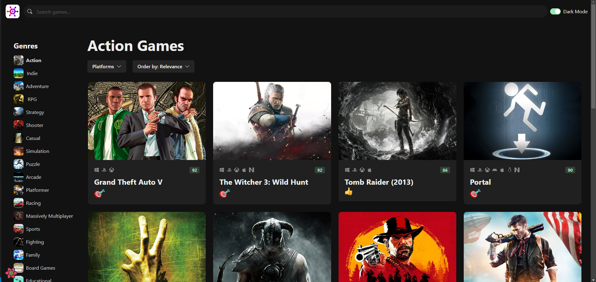

# Game Hub 🎮

A simple web app that displays a collection of games with information about each game, including its rating and description. This project is designed to provide an easy way to browse games and see relevant details all in one place.

## Project Overview

Game Hub is a web app built with **React** and **Next.js**, allowing users to explore a wide variety of games. Each game is presented with detailed information such as the title, description, rating, and more.

## Screenshot



## Live Demo

Check out the live version of the project deployed on Vercel:  
[Game Hub Live](https://game-hub-lilac-three.vercel.app)

## Features

- 🕹️ Display of all games with essential information
- ⭐ Rating system for each game
- 🔍 Search functionality to filter games by title
- 📊 Sorting options to arrange games by rating or release date
- 🖼️ Visual representation of each game (images/screenshots)

## Technologies Used

- **React**: Frontend library for building the user interface.
- **Next.js**: Framework for server-side rendering and static site generation.
- **CSS**: Styling for the game cards and layout.
- **API**: Backend service to fetch game details and ratings (if applicable).

## Installation

To run the project locally:

1. Clone the repository:

```bash
git clone https://github.com/yourusername/game-hub.git
```
